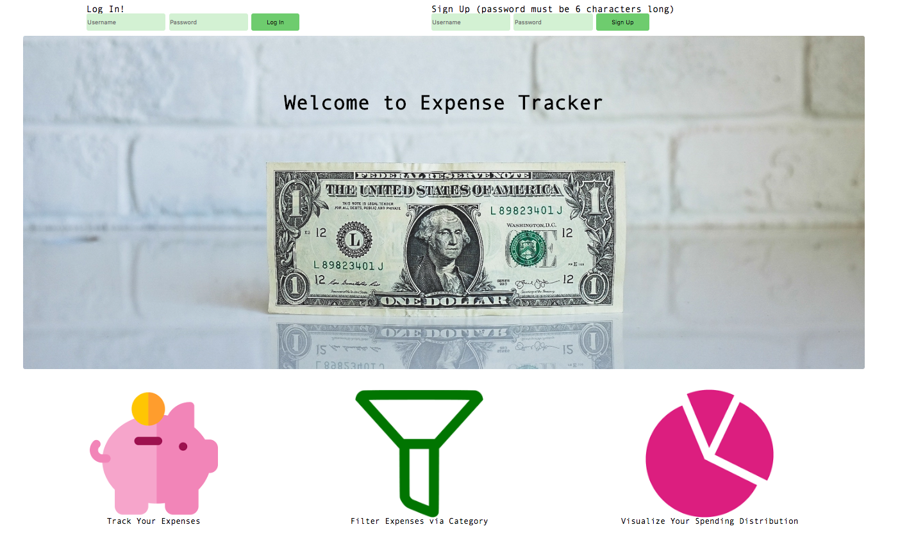

# Expense Tracker

Live link: https://expense-tracker1.herokuapp.com/

- Allows users to sign up/log in and track their expenses. Expenses are comprised of an amount, description, date, and category.
- The Expense Index displays expenses with the most recent on top and can be filtered by category.
- A simple pie chart helps users visualize how their expenses are broken down by category.
- To use the app, you can create a new profile by signing up with a username and password. However, if you'd like to see a profile with 4 expenses already seeded, you can use the username: "tester", password: "starwars" (on the seeds.rb file as user1) to log in.

  
